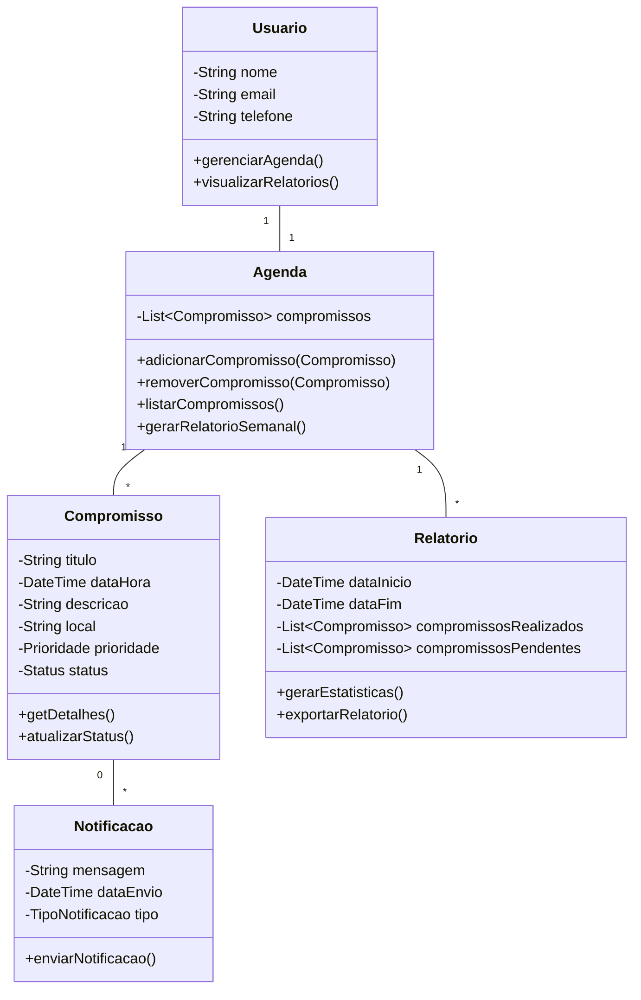

# Agenda

## Diagrama

```mermaid
classDiagram
    class Agenda {
        -List~Compromisso~ compromissos
        +adicionarCompromisso(Compromisso)
        +removerCompromisso(Compromisso)
        +listarCompromissos()
        +gerarRelatorioSemanal()
    }
    
    class Compromisso {
        -String titulo
        -DateTime dataHora
        -String descricao
        -String local
        -Prioridade prioridade
        -Status status
        +getDetalhes()
        +atualizarStatus()
    }
    
    class Relatorio {
        -DateTime dataInicio
        -DateTime dataFim
        -List~Compromisso~ compromissosRealizados
        -List~Compromisso~ compromissosPendentes
        +gerarEstatisticas()
        +exportarRelatorio()
    }
    
    class Usuario {
        -String nome
        -String email
        -String telefone
        +gerenciarAgenda()
        +visualizarRelatorios()
    }
    
    class Notificacao {
        -String mensagem
        -DateTime dataEnvio
        -TipoNotificacao tipo
        +enviarNotificacao()
    }
    
    Usuario "1" -- "1" Agenda
    Agenda "1" -- "*" Compromisso
    Agenda "1" -- "*" Relatorio
    Compromisso "0" -- "*" Notificacao
```
